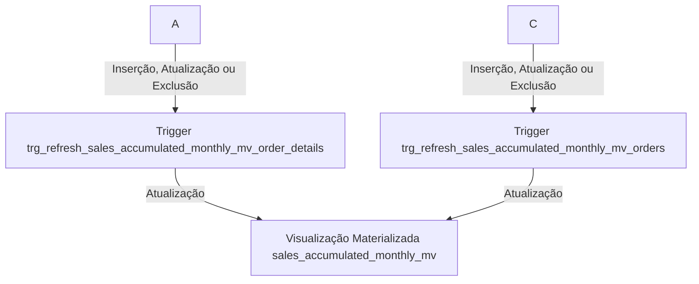
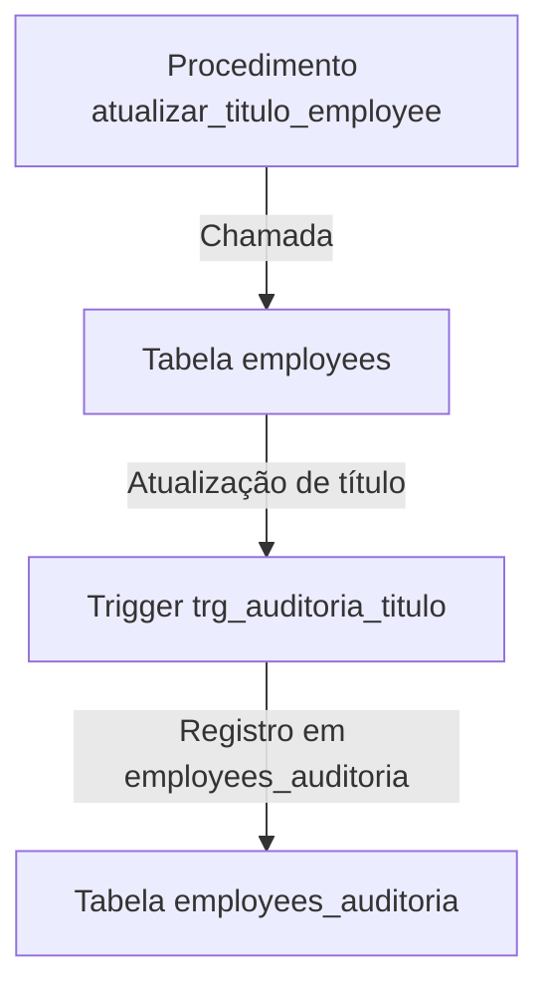

# Relatórios Avançados em SQL Northwind

## Objetivo

Este repositório tem como objetivo apresentar relatórios avançados construídos em SQL. As análises disponibilizadas aqui podem ser aplicadas em empresas de todos os tamanhos que desejam se tornar mais analíticas. Através destes relatórios, organizações poderão extrair insights valiosos de seus dados, ajudando na tomada de decisões estratégicas.

## Relatórios que vamos criar

1. **Relatórios de Receita**
    
    * Qual foi o total de receitas no ano de 1997?

    ```sql
    CREATE VIEW total_revenues_1997_view AS
    SELECT SUM((order_details.unit_price) * order_details.quantity * (1.0 - order_details.discount)) AS total_revenues_1997
    FROM order_details
    INNER JOIN (
        SELECT order_id 
        FROM orders 
        WHERE EXTRACT(YEAR FROM order_date) = '1997'
    ) AS ord 
    ON ord.order_id = order_details.order_id;
    ```

    * Faça uma análise de crescimento mensal e o cálculo de YTD

    ```sql
    CREATE VIEW view_receitas_acumuladas AS
    WITH ReceitasMensais AS (
        SELECT
            EXTRACT(YEAR FROM orders.order_date) AS Ano,
            EXTRACT(MONTH FROM orders.order_date) AS Mes,
            SUM(order_details.unit_price * order_details.quantity * (1.0 - order_details.discount)) AS Receita_Mensal
        FROM
            orders
        INNER JOIN
            order_details ON orders.order_id = order_details.order_id
        GROUP BY
            EXTRACT(YEAR FROM orders.order_date),
            EXTRACT(MONTH FROM orders.order_date)
    ),
    ReceitasAcumuladas AS (
        SELECT
            Ano,
            Mes,
            Receita_Mensal,
            SUM(Receita_Mensal) OVER (PARTITION BY Ano ORDER BY Mes) AS Receita_YTD
        FROM
            ReceitasMensais
    )
    SELECT
        Ano,
        Mes,
        Receita_Mensal,
        Receita_Mensal - LAG(Receita_Mensal) OVER (PARTITION BY Ano ORDER BY Mes) AS Diferenca_Mensal,
        Receita_YTD,
        (Receita_Mensal - LAG(Receita_Mensal) OVER (PARTITION BY Ano ORDER BY Mes)) / LAG(Receita_Mensal) OVER (PARTITION BY Ano ORDER BY Mes) * 100 AS Percentual_Mudanca_Mensal
    FROM
        ReceitasAcumuladas
    ORDER BY
        Ano, Mes;
    ```

2. **Segmentação de clientes**
    
    * Qual é o valor total que cada cliente já pagou até agora?

    ```sql
    CREATE VIEW view_total_revenues_per_customer AS
    SELECT 
        customers.company_name, 
        SUM(order_details.unit_price * order_details.quantity * (1.0 - order_details.discount)) AS total
    FROM 
        customers
    INNER JOIN 
        orders ON customers.customer_id = orders.customer_id
    INNER JOIN 
        order_details ON order_details.order_id = orders.order_id
    GROUP BY 
        customers.company_name
    ORDER BY 
        total DESC;
    ```

    * Separe os clientes em 5 grupos de acordo com o valor pago por cliente

    ```sql
    CREATE VIEW view_total_revenues_per_customer_group AS
    SELECT 
    customers.company_name, 
    SUM(order_details.unit_price * order_details.quantity * (1.0 - order_details.discount)) AS total,
    NTILE(5) OVER (ORDER BY SUM(order_details.unit_price * order_details.quantity * (1.0 - order_details.discount)) DESC) AS group_number
    FROM 
        customers
    INNER JOIN 
        orders ON customers.customer_id = orders.customer_id
    INNER JOIN 
        order_details ON order_details.order_id = orders.order_id
    GROUP BY 
        customers.company_name
    ORDER BY 
        total DESC;
    ```


    * Agora somente os clientes que estão nos grupos 3, 4 e 5 para que seja feita uma análise de Marketing especial com eles

    ```sql
    CREATE VIEW clients_to_marketing AS
    WITH clientes_para_marketing AS (
        SELECT 
        customers.company_name, 
        SUM(order_details.unit_price * order_details.quantity * (1.0 - order_details.discount)) AS total,
        NTILE(5) OVER (ORDER BY SUM(order_details.unit_price * order_details.quantity * (1.0 - order_details.discount)) DESC) AS group_number
    FROM 
        customers
    INNER JOIN 
        orders ON customers.customer_id = orders.customer_id
    INNER JOIN 
        order_details ON order_details.order_id = orders.order_id
    GROUP BY 
        customers.company_name
    ORDER BY 
        total DESC
    )

    SELECT *
    FROM clientes_para_marketing
    WHERE group_number >= 3;
    ```

3. **Top 10 Produtos Mais Vendidos**
    
    * Identificar os 10 produtos mais vendidos.

    ```sql
    CREATE VIEW top_10_products AS
    SELECT products.product_name, SUM(order_details.unit_price * order_details.quantity * (1.0 - order_details.discount)) AS sales
    FROM products
    INNER JOIN order_details ON order_details.product_id = products.product_id
    GROUP BY products.product_name
    ORDER BY sales DESC;
    ```

4. **Clientes do Reino Unido que Pagaram Mais de 1000 Dólares**
    
    * Quais clientes do Reino Unido pagaram mais de 1000 dólares?

    ```sql
    CREATE VIEW uk_clients_who_pay_more_then_1000 AS
    SELECT customers.contact_name, SUM(order_details.unit_price * order_details.quantity * (1.0 - order_details.discount) * 100) / 100 AS payments
    FROM customers
    INNER JOIN orders ON orders.customer_id = customers.customer_id
    INNER JOIN order_details ON order_details.order_id = orders.order_id
    WHERE LOWER(customers.country) = 'uk'
    GROUP BY customers.contact_name
    HAVING SUM(order_details.unit_price * order_details.quantity * (1.0 - order_details.discount)) > 1000;
    ```

## Contexto

O banco de dados `Northwind` contém os dados de vendas de uma empresa  chamada `Northwind Traders`, que importa e exporta alimentos especiais de todo o mundo. 

O banco de dados Northwind é ERP com dados de clientes, pedidos, inventário, compras, fornecedores, remessas, funcionários e contabilidade.

O conjunto de dados Northwind inclui dados de amostra para o seguinte:

* **Fornecedores:** Fornecedores e vendedores da Northwind
* **Clientes:** Clientes que compram produtos da Northwind
* **Funcionários:** Detalhes dos funcionários da Northwind Traders
* **Produtos:** Informações do produto
* **Transportadoras:** Os detalhes dos transportadores que enviam os produtos dos comerciantes para os clientes finais
* **Pedidos e Detalhes do Pedido:** Transações de pedidos de vendas ocorrendo entre os clientes e a empresa

O banco de dados `Northwind` inclui 14 tabelas e os relacionamentos entre as tabelas são mostrados no seguinte diagrama de relacionamento de entidades.


# Utilização de Materialized Views, Triggers e Stored Procedures

**Objetivo: Exemplificar o Uso de Materialized Views, Triggers e Stored Procedures em um Contexto de Business Intelligence**

Este repositório também tem como objetivo apresentar relatórios avançados construídos em SQL, demonstrando a aplicação prática de conceitos fundamentais de Business Intelligence (BI). As análises disponibilizadas aqui são projetadas para serem aplicadas em empresas de todos os tamanhos, ajudando-as a se tornarem mais analíticas e orientadas por dados.

**Como Funciona:**

1. **Materialized Views:** As Materialized Views são utilizadas para pré-calcular e armazenar resultados de consultas complexas. Neste cenário, as Materialized Views são empregadas para melhorar o desempenho de consultas frequentes e fornecer acesso rápido a dados agregados essenciais para análises.
    
2. **Triggers:** Triggers são mecanismos que permitem a execução automática de ações em resposta a eventos específicos no banco de dados. Neste contexto, as Triggers são empregadas para garantir a integridade dos dados e aplicar lógica de negócios, como validações e atualizações automáticas.
    
3. **Stored Procedures:** Stored Procedures são conjuntos de instruções SQL pré-compiladas e armazenadas no banco de dados. Elas podem ser chamadas repetidamente para executar tarefas complexas de forma eficiente e consistente. Neste caso, as Stored Procedures são utilizadas para automatizar processos de ETL (Extração, Transformação e Carregamento) e realizar operações avançadas de manipulação de dados.

**Benefícios:**

* **Extração de Insights Valiosos:** Os relatórios avançados disponibilizados neste repositório permitem que as organizações extraiam insights valiosos de seus dados, proporcionando uma compreensão mais profunda de seus processos e desempenho.
* **Apoio à Tomada de Decisões Estratégicas:** Com acesso a análises detalhadas e atualizadas, as empresas podem tomar decisões estratégicas mais informadas e direcionadas, impulsionando o crescimento e a eficiência operacional.]

**Caso Materialized View:**



Este conjunto de comandos SQL define uma ETL (Extração, Transformação e Carregamento) para gerar um relatório de vendas acumuladas mensais. A ETL consiste em uma visualização materializada chamada `sales_accumulated_monthly_mv` e duas triggers que garantem que a visualização seja atualizada sempre que houver alterações nas tabelas `order_details` e `orders`.

1. **Visualização Materializada (`sales_accumulated_monthly_mv`):** Esta visualização materializada calcula a soma acumulada das vendas mensais. Ela extrai o ano e o mês da data do pedido e calcula a soma das vendas para cada mês. Os resultados são agrupados por ano e mês.
    
2. **Trigger para Atualização da Visualização (`trg_refresh_sales_accumulated_monthly_mv_order_details` e `trg_refresh_sales_accumulated_monthly_mv_orders`):** Duas triggers foram criadas para garantir que a visualização materializada seja atualizada sempre que houver alterações nas tabelas `order_details` e `orders`. Quando ocorrerem inserções, atualizações ou exclusões nessas tabelas, as triggers acionarão a função `refresh_sales_accumulated_monthly_mv`, que atualizará a visualização materializada.

**Caso Stored Procedured:**




Este conjunto de comandos SQL visa monitorar e atualizar alterações nos títulos dos funcionários na tabela `employees` e registrar essas mudanças na tabela `employees_auditoria`.

1. **Tabela de Auditoria de Funcionários (`employees_auditoria`):** Uma tabela foi criada para registrar as mudanças nos títulos dos funcionários. Ela possui os seguintes campos:
    
    * `employee_id`: O ID do funcionário afetado.
    * `nome_anterior`: O título anterior do funcionário.
    * `nome_novo`: O novo título do funcionário.
    * `data_modificacao`: A data e hora da modificação (com o valor padrão definido como o momento atual).
2. **Trigger para Auditoria de Títulos (`trg_auditoria_titulo`):** Uma trigger foi criada para ser acionada após a atualização do título na tabela `employees`. Esta trigger chama uma função que registra a mudança na tabela `employees_auditoria`.
    
3. **Procedimento para Atualização de Título (`atualizar_titulo_employee`):** Uma stored procedure foi criada para facilitar a atualização do título de um funcionário. Ela aceita o ID do funcionário e o novo título como parâmetros e executa uma atualização na tabela `employees`.

**Conclusão:**

Este repositório oferece uma oportunidade única para empresas de todos os setores aproveitarem o poder do Business Intelligence por meio de relatórios avançados em SQL. Ao adotar essas práticas, as organizações podem transformar dados em insights acionáveis, impulsionando o sucesso e a inovação em um ambiente competitivo.

## Configuração Inicial

### Manualmente

Utilize o arquivo SQL fornecido, `nortwhind.sql`, para popular o seu banco de dados.

### Com Docker e Docker Compose

**Pré-requisito**: Instale o Docker e Docker Compose

* [Começar com Docker](https://www.docker.com/get-started)
* [Instalar Docker Compose](https://docs.docker.com/compose/install/)

### Passos para configuração com Docker:

1. **Iniciar o Docker Compose** Execute o comando abaixo para subir os serviços:
    
    ```
    docker-compose up -d --build
    ```
    
    Aguarde as mensagens de configuração, como:
    
    ```csharp
    Creating network "northwind_psql_db" with driver "bridge"
    Creating volume "northwind_psql_db" with default driver
    Creating volume "northwind_psql_pgadmin" with default driver
    Creating pgadmin ... done
    Creating db      ... done
    ```
       
2. **Conectar o PgAdmin** Acesse o PgAdmin pelo URL: [http://localhost:5050](http://localhost:5050), com a senha `postgres`. 

Configure um novo servidor no PgAdmin:
    
    * **Aba General**:
        * Nome: db
    * **Aba Connection**:
        * Nome do host: db
        * Nome de usuário: postgres
        * Senha: postgres Em seguida, selecione o banco de dados "northwind".

3. **Parar o Docker Compose** Pare o servidor iniciado pelo comando `docker-compose up` usando Ctrl-C e remova os contêineres com:
    
    ```
    docker-compose down
    ```
    
4. **Arquivos e Persistência** Suas modificações nos bancos de dados Postgres serão persistidas no volume Docker `postgresql_data` e podem ser recuperadas reiniciando o Docker Compose com `docker-compose up`. Para deletar os dados do banco, execute:
    
    ```
    docker-compose down -v
    ```
